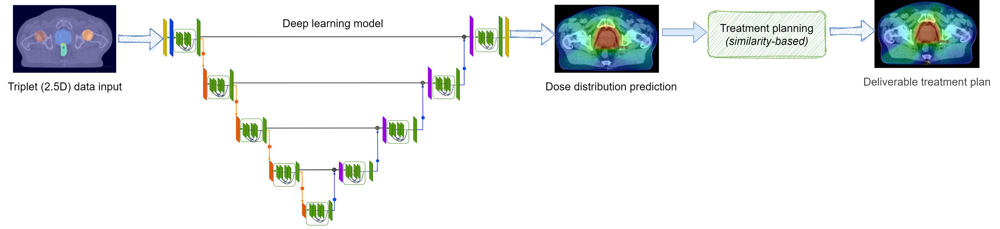

# Deep-Learning-Dose-Prediction

This repository contains the code used for our paper _“VMAT dose prediction and deliverable treatment plan generation for prostate cancer patients using a densely connected volumetric deep learning model”_. (under review)  
  
In our work we used a densely connected convolutional neural network based on a UNet architecture, to predict volumetric modulated arc therapy (VMAT) dose distributions for prostate cancer patients. Model training was performed using so called image triplets, which can be considerered as 2.5D data. In addition, we generated deliverable, optimized treatment plans based on the dose predicions, using a (to our knowledge), novel treatment planning workflow, based on a similarity metric.

The repository contains the following parts:

- **Preprocessing:** generates 2D and 2.5D (triplets) data from 3D volumes
- **Training:** Provides a densely connected UNet architecture that can be trained for VMAT dose predictions with triplets (2.5D data)
- **Dose search:** A script to find a similar dose distribution from a database of dose distributions using the mean squared error (MSE) as a similarity metric

## Before you start

### Setup and requirements

- Clone the repository using Git Bash or the console  ``git clone https://ADRESS_TO_THE_GITHUB_REPOSITORY``.  

- Create a virtual environment by typing ``virtualenv env_name`` into the console.
  Once the virtual environment has been set up, it can be activated using ``source env_name/bin/activate``

- Install the required libraries in the requirement.txt with  ``pip3 install -r requirements.txt``

Now all needed packages should have been installed into the virtual environment and the scripts can be run.  
We recommend to run model training with the **NVIDIA driver 450.80.02** and **cuDNN CUDA version 10.1**, which are the driver versions used and tested.  

### Configuration File

All configuration parameters needed for training the model are stored in the ``config.ini`` file located in settings folder.
The configuration file must be adjusted, according to the file paths as well as training/validation split files used.

#### .csv cross-validation files

When the 2.5D dataset is created, the dataset is automatically split into 5-fold cross validation files. In the configuration file ist is possible to either provide the path to the cross-validation folder folder or a specific file.
If a .csv file is given, a single model will be trained. If a folder is given, a cross-validation is run, training 5 different models. The .csv files in the folder should follow the naming convention ``d_split_kx.csv``, where x is a number between 0-4.

## Preprocessing

The preprocessing script creates a 2D and a 2.5D dataset from given 3D volumes including RT Dose, CT images and RT structure sets.
To create the 3D volumes the MICE toolkit can be used, which is based on simpleITK. A free version is available here:

https://micetoolkit.com/

We also provid a screenshot of an example MICE workflow in the images folder of this repository. This workflow can be used to extract segmentation structures, dose matrices and CT images from DICOM files.

The expected folder structure for the 3D data is:
- Patient01
  - Dose
    - dose.npy   
  - masks
    - masks.npy 
  - CT   
    - CT.npy 
- Patient02
  - Dose
    - dose.npy   
  - masks
    - masks.npy 
  - CT   
    - CT.npy 
    
    ...

To create triplets (2.5D data) as used in our paper, run the ``create_dataset.py`` script using the console:
``python3 create_dataset.py -p PATH_TO_3D_DATA``
By running this script, a new folder is created, creating a 2D dataset, and a 2.5D dataset.
In addition, the script automatically creates csv files used for 5-fold cross validation training.

## Model

### Training

To train the model run the ``python3 train.py`` file. Depending on the configuration file, a single model is trained, or a cross-validation performed, resulting in 5 different models.
Model checkpoints are saved regulary, but this setting can be changed by modifying the ``CustomSaver.py`` script or building a self-defined checkpoint.
Training and validation processes are written to logfiles during training and can be examined using Tensorboard and can be examined during model training. For this, type ``tensorboard --logdir logs/fit`` in the console.

### Prediction

To predict a dose distribution using a trained model, run ``predict.py -id xyz`` from the console, where xyz is the subjectID for which a prediction should be performed.
To visualize the predicted dose runt ``predict.py -id xyz -v True``.

### Dose search

In our paper we use the MSE as a similarity measure, to find a dose distribution from a database, that is similar to the predicted dose distribution.
The predicted dose in combination with the closest distribution (accroding to the MSE measure) can then be used to derive new optimization objectives for VMAT treatment planning using a clinical treatment planning system (TPS).
To use the dose search function, a trained model is loaded, which then predicts a dose distribution based on 2.5D data. This prediction can then be compared to a database of distributions, by first aligning the database dose distributions to the predition and then computing the MSE.

To find a similiar dose distribution from the DB for a particular test patient, run the ``dose_search.py`` script using the console:  
``python3 dose_search.py -id subjectID``

For accelerated computation of the MSE values the script is implemented using multiprocessing. The script automatically uses the maximum number of CPUs available.  
To change the number of kernels the script can be run by:  
``python3 dose_search.py -id subjectID -cpu numberOfKernels``

**Note**: In our current implmentation we assume that the DB contains dose distributions as well as triplet (2.5D) data for all patients, which are used to derive the PTV center coordinates. Storing triplets for all DB subjects is normally not needed, as the PTV center coordinates could be derived prior to the dose search and stored as a numeric value. This should reduce the computational time quite a lot. It should also be noted that the dose_search script might need some minor adaptions, depending on how data is stored.
